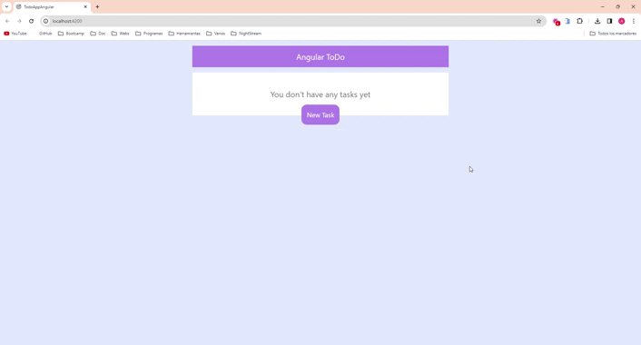

# TodoAppAngular

Hola! Este es mi proyecto de lista de tareas realizado con angular. He realizado este proyecto para prácticar con angular y conocer mejor el funcionamiento de este framework. Espero que os guste, nos vemos!

## Installation

1. Clone this repository to your local computer.
2. Ensure you have Node.js installed.
3. Execute the following command to install the dependencies:

```bash
npm install
```

## Usage

To start the application, use the following command:

```bash
ng serve
```

or

```bash
ng serve -o
```

1. Open your browser and go to http://localhost:4200/ (or the URL displayed in your terminal).
2. Begin recording your expenses and income.
3. The application will automatically calculate your balance and display a detailed transaction history.

## Contribution

If you wish to contribute to this project, please follow these steps:

1. Fork the repository.
2. Create a new branch for your feature: git checkout -b feature/new-feature.
3. Make your changes and commit: git commit -m 'Add new feature'.
4. Push your changes to the remote repository: git push origin feature/new-feature.
5. Open a Pull Request on GitHub.

## Preview



## Contact

If you have any questions or suggestions, don't hesitate to contact me:

- Name: Adrián Ramírez
- Email: adrianramirezgalera@gmail.com
- GitHub: [AdrianRgGit](https://github.com/AdrianRgGit)

Thank you for using my application! I hope it proves useful to you.
